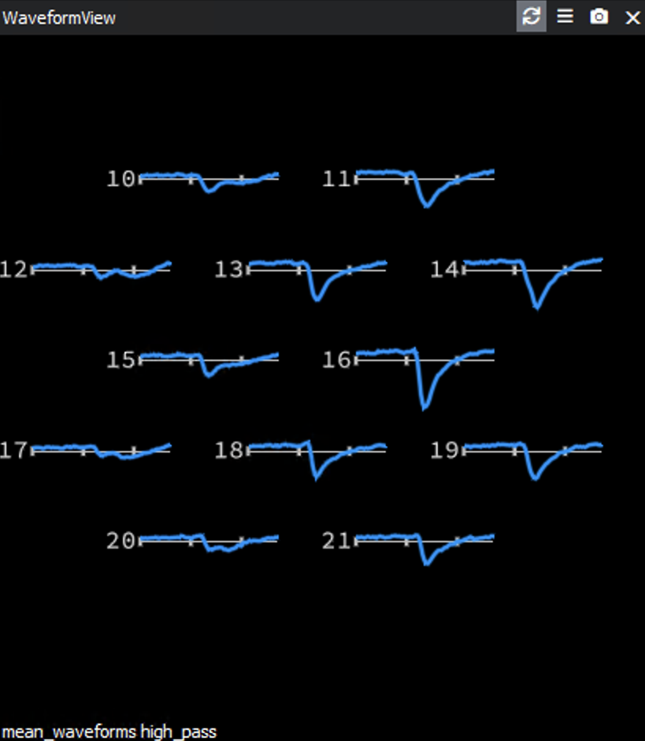
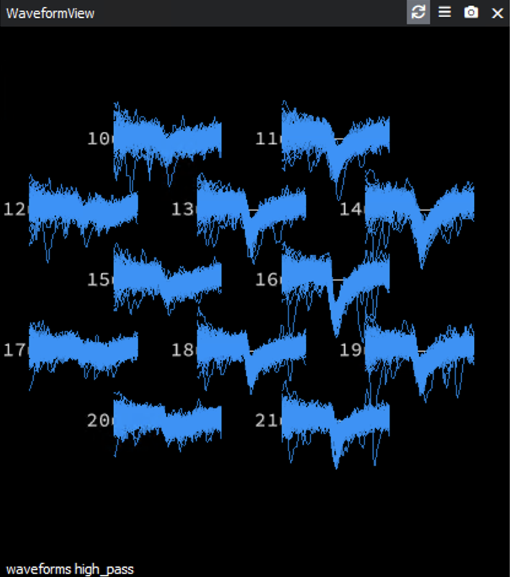
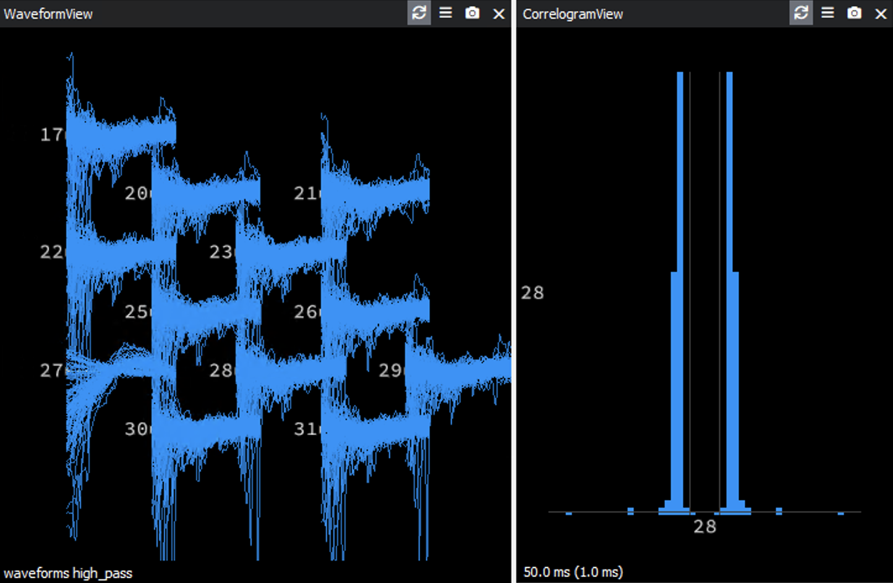
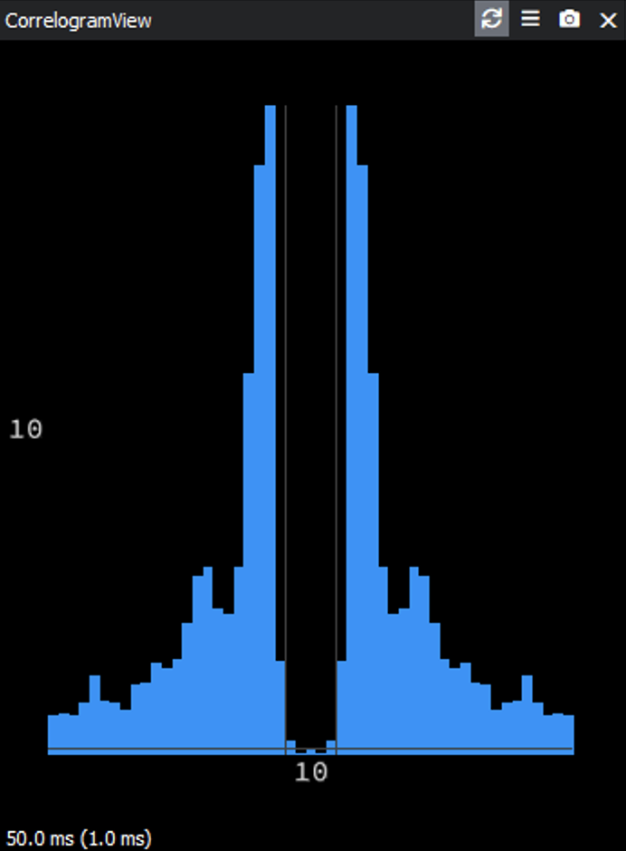
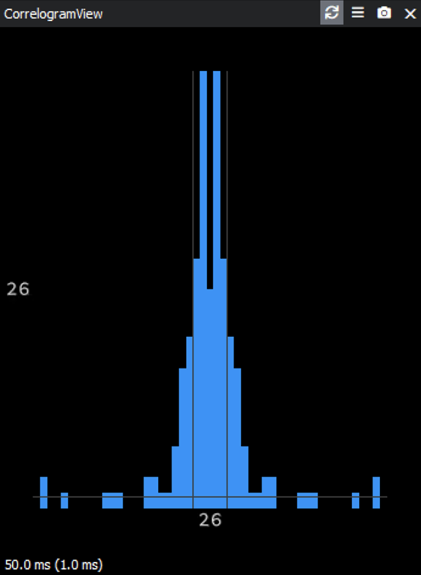
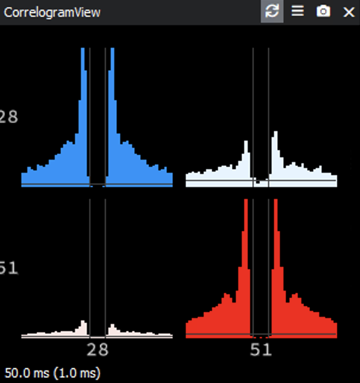
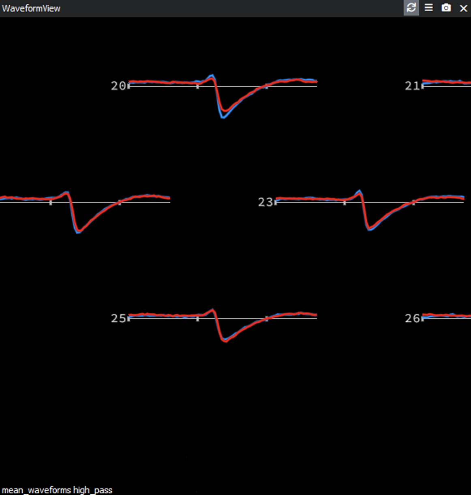

# Kilosort Instructions
### This script is used to explain how to manually curate electrophysiological data using Kilosort. While browsing through each section, reference the example pictures below.

## Schematic to Follow:

## Section 1: Browsing Through All Units
### Summary:
The first step is to quickly browse through all the units and check the waveform view. 

### Steps:
Does the waveform shape look like a spike?
* Yes &rightarrow; Continue onto next unit
* No &rightarrow; Throw out to Noise by pressing “Alt-N” or “option-N”

Once you look through all the units, move onto the next section.

### Examples:
Normal Waveform:

 

Noise:

 

## Section 2: Evaluating Individual Units 
### Summary:
This next section is to check each individual unit and evaluate its features to ensure that it is a good unit. The waveform, refractory period, and amplitude view are the three most important features to look at when evaluating it by itself. 

### Steps:
1. Does the meaned waveform look like the unmeaned? Make sure you look at both. Does it look like one cell? Does it have a smooth waveform (not a ω shape)?
    * Yes &rightarrow; Continue to next step
	* No &rightarrow; Look at unmeaned, does it look like there is two groups of waveforms (very similar waveform) that look the same but have different amplitudes? (See pictures below)
	    * Yes &rightarrow; Continue to next step
	    * No &rightarrow; Throw out to MUA by pressing “Alt-M” or “option-M”
 2. Check the Correlogram and ISI view. Does the correlogram show a refractory period? Check this in ISI as well. The pictures below show good refractory periods.
    * Yes &rightarrow; Continue to next step
	* No &rightarrow; Throw out to MUA by pressing “Alt-M” or “option-M”
3. Check the Amplitude view. Does the amplitude of the unit (in color) separate out from the noise (grey)? Are there two separate clusters/chunks (MUA)?
    * Yes &rightarrow; Continue to next step
	* No &rightarrow; Is the contamination easily removable?
        * Yes &rightarrow; Try cutting it out and looking at the ACG. (This is done by holding down the CRL button and clicking the area. Once there is a selection, press K.) If it shows a better refractory period, continue. If not, undo and throw out to MUA.
        * No &rightarrow; Throw out to MUA by pressing “Alt-M” or “option-M”

### Other Features to Consider:
1. How many spikes does it have?
    * If the unit looks good, you can keep it.
    * If there are less than 100 spikes, consider throwing out if it is causing you trouble.
    * Each overall recording might have a different average number of spikes per unit. Different time lengths might have different spike numbers.
2. How big is the dip in the waveform? Is there actually something?
    * If you are looking and the line looks flat, first check your scaling to make sure nothing is being hidden.
    * If there is something, continue with the steps. 
    * If the line is still flat and/or messy, you can label MUA.

### Examples:
Normal Waveform:

 

"W-Shape" Waveform:

Two Groups of Waveforms/Bursty Cell:

Normal Auto-Correlogram:

 

Contaminated Auto-Correlogram:

 

## Section 3: Comparing Units
### Summary:
The last portion of this process is to compare the unit from section 2 to other units to see if the software separated one neuron into 2 units. 

Here, the most important feature are the correlograms. The Auto Correlograms (ACG) are in color, and the Cross Correlograms (CCG) are in white.

Make sure similarity view is set to sort by Similarity. Press the space bar to reach the most similar unit. 

### Steps:
1. Check correlograms in the Correlogram View. Do the ACG's look the same? Does the CCG look like the ACG of the cells? 
    * Yes &rightarrow; Continue to Next Step
    * No &rightarrow; Is the CCG flat and contains no noticeable refractory period?
	* Yes &rightarrow; Continue to Next Step
        * No &rightarrow; Do there appear to be any spikes in the window for the CCG?
            * Yes, a refractory period but many violations &rightarrow; Continue to next step (consider discarding the cell with fewer spikes)
            * No &rightarrow; Proceed to next most similar unit and restart Section 3 (use your judgement based on other features of the cell)
2. Do the waveforms look the same? 
    * Yes &rightarrow; Continue to Decision Making
    * No &rightarrow; Do they look the same but vary slightly in amplitude?
	* Yes &rightarrow; Continue to Decision Making
        * No &rightarrow; Proceed to next most similar unit and restart Section 3

### Decision Making:
* If you are not considering merging and your unit looks good, you can mark the unit as good by pressing "Alt-G" or "Option-G" and restarting Section 2.
* If there is clear separation of the clusters in all features, the cells probably should not be merged. 
* If you are considering merging:
    1. If they overlap in most/all features, consider merging.
    2. Before merging, check the top 5 similar units. Then if there are no other close calls, Merge the units by pressing "G". Proceed to check the similarity of the merged unity against a few other units using Section 3 steps.
    3.  After checking the unit against 5 similar clusters, classify the unit as good by pressing "Alt-G" or "Option-G".

### Examples:

Good Cross Correlogram for Merging:

Good Waveforms:

 

## Section 4: Double Check
Go through all the good ones one more time once you’ve finished.
