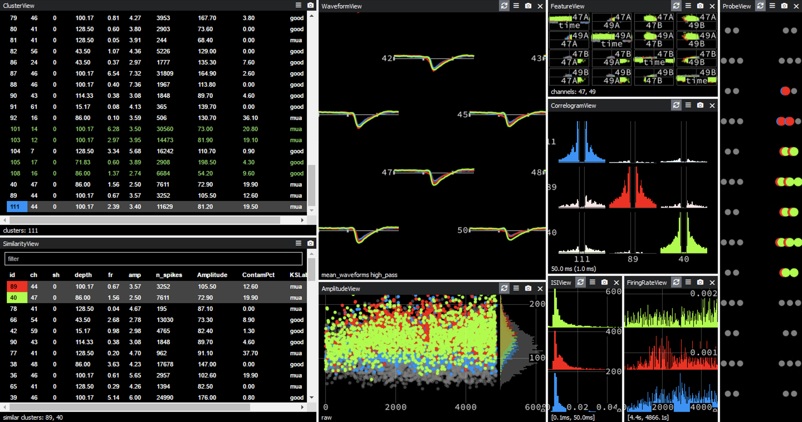

# Special Cases and Questions for Kilosort Decisions

## 1. What happens when there is more than one similar unit when comparing?
   
### Summary:
   * Compare them in sets of two as well as comparing them all together. 
   * If all of the units look good together, merge and compare to others.
   * If only some of the units look good enough to merge, then merge only those and evaluate the left over ones.
   * Only mark the last one good if it isn't causing you trouble in other decisions.
   * Focus mainly on the cross-correlograms, refractory periods are the most important.

### Example:

   * Here,

## 2. What happens when half of the channels show MUA but the other half look really nice?

### Summary:
   * As long as the main channel’s waveform looks good, then it is okay to ignore the MUA in the other channels. 
   * This could just be because of a lot of activity happening at the same time.

### Example:

*insert picture*

## 3. What are bursting cells, what do they look like, and how do you analyze them?

### Summary:
   * A bursting cell is a cell that fires a bunch of spikes in a row.
   * In general, the amplitude seems to decrease over time.
   * They have a wide range of spike amplitudes even though its the same cell.
   * Bursting cells will have very similar shapes to their waveforms, but just dip slightly lower/higher like shown below.

### Example:

*insert picture*

## 4. What happens when there is a clear refractory period, but only on one side of the CCG?

### Summary:
   * It is only good to consider it a refractory period if there is a dip from both sides.
   * If it is fully flat on one side, then lean towards not merging.

### Example:

*insert picture*  

## 5. What happens when one of the units doesn't have enough spikes to show the CCG/ACG?

### Summary:
   * If there is so few spikes for no ACG to show up, then throw the unit out to MUA.
   * If the unit has similarities in every other aspect yet there is no CCG, consider merging.
      * This is dependent on the application of the data, which is more important to your project: more spikes or spike quality?

### Example:

*insert picture*

## 6. What happens when there is a large spike in the middle of a CCG but there is no other contamination in the gap?

### Summary:
   * A large spike in the middle means that the program is either double counting the same spikes or these two separate.
   * The trace view can look at individual spikes and determine whether or not it is actually double counted
   * With these, you keep the better unit.
      * This will most likely be the one with more spikes, but if the one with more spikes is significantly worse than the other, keep the other one.

### Example:

*insert picture*
